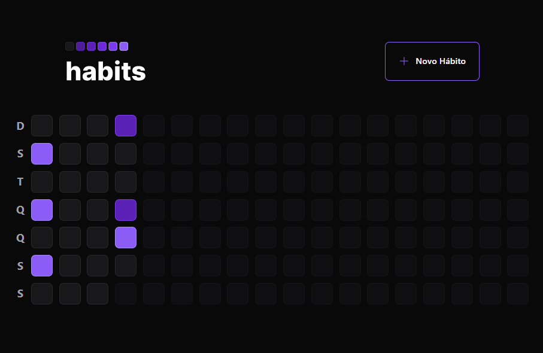
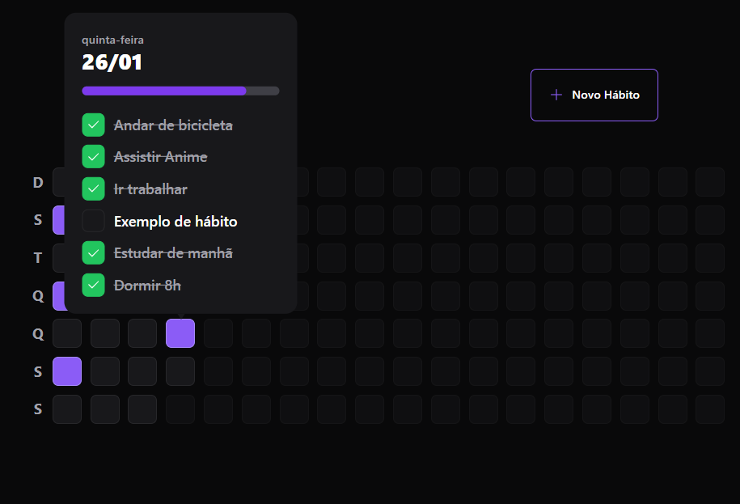
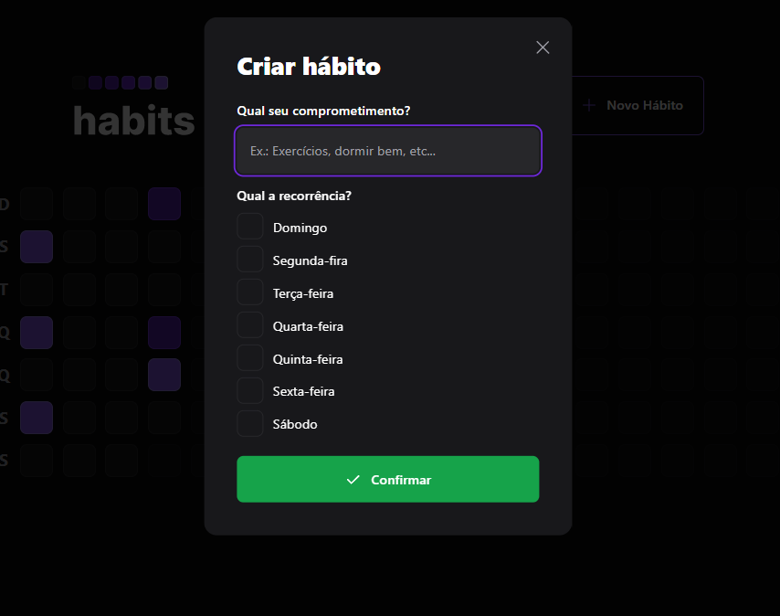
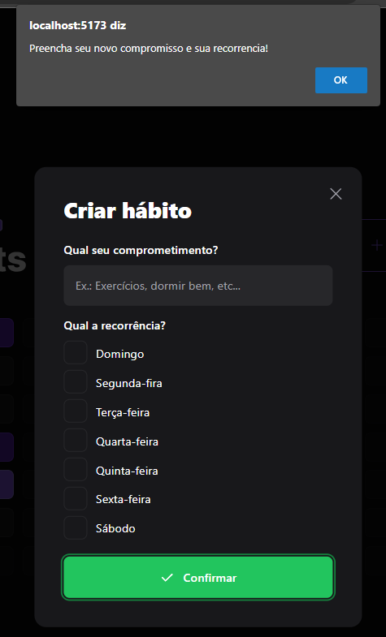

# Projeto criado no NLW_Setup da Rockeseat
Este projeto tem como objetivo servir como uma aplicação tanto mobile quano web para o cadastro de novos hábitos e também para o acompanhementos desses novos hábitos.

## Tecnologias
- ReactJs
- React Native
- Axios
- Tailwind CSS
- Radix ui

## A plicação

