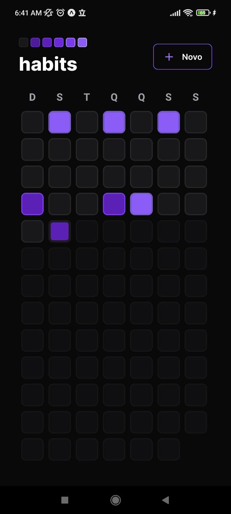
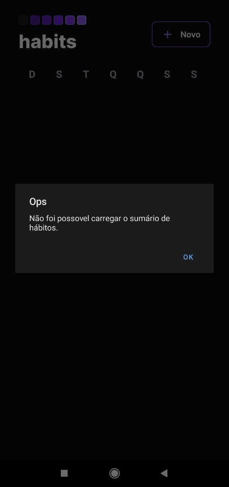
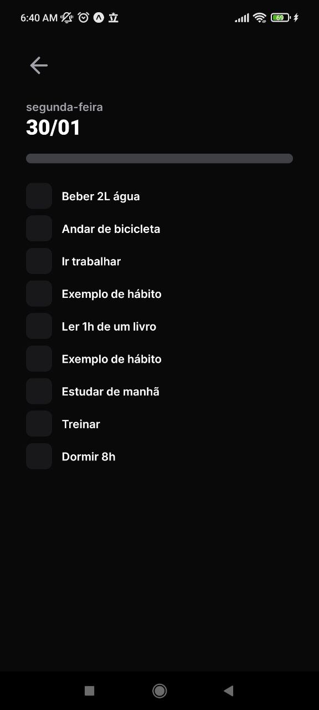
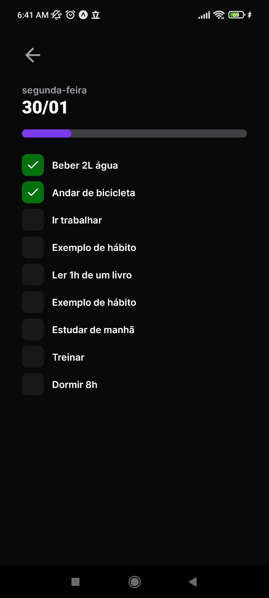
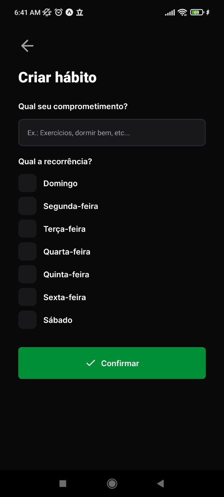
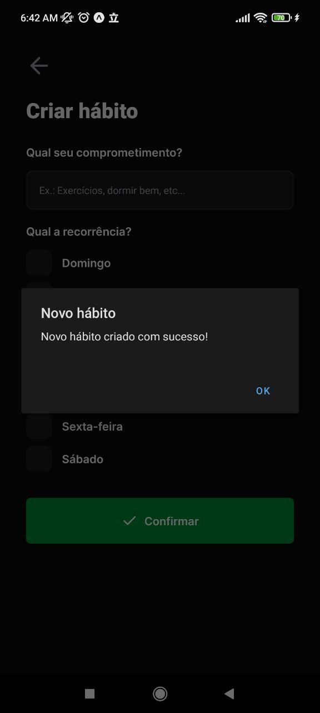
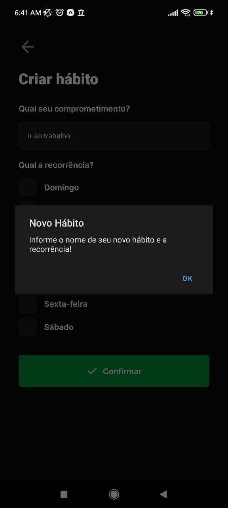
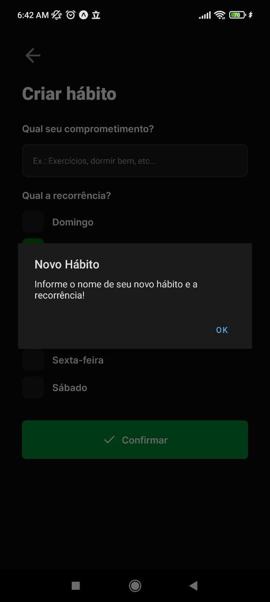
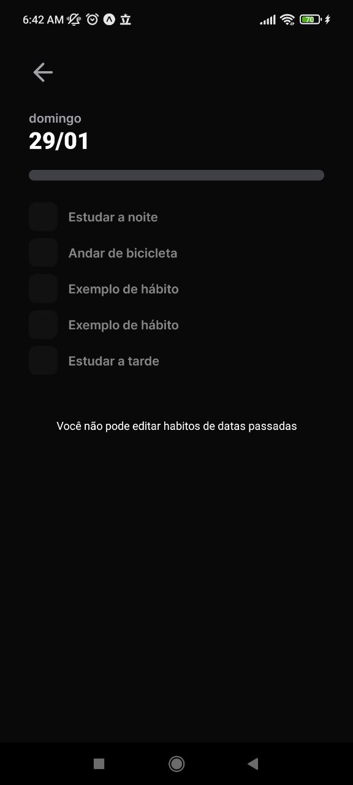

# Projeto criado no NLW_Setup da Rockeseat
Este projeto tem como objetivo apresentar uma aplicação que possa ser acessada tanto em ambientes web quanto mobile, sendo possível cadastrar hábitos que podem ser acompanhados durante o dia através da tela inicial da aplicação durante em seu dia-dia.

## Tecnologias
- ReactJs 
- React Native 
- Axios 
- Tailwind CSS 
- Radix UI 
- SQLite 

## Aplicação

  
Web

Tela incial
-----------------
Tela inicial da aplicação, onde é possível realizar a navegação entre as funcionalidades da mesma:
- Verificação de hábitos
- Completar hábitos
- Verificar o progresso e rendimento diário
- Adicionar novos hábitos

### Tela de verificação de hábitos
Nesta tela é possível verificar quais hábitos foram realizados ao decorrer da semana, clicando em um dia específico

### Tela de cadasto novos hábitos
Nesta parte você pode esta cadastrando novos hábitos e a frequência com que deseja realizar ele durante a semana.

### Validação para cadastro de dados
Este alerta sempre vai aparecer na tela caso você tente cadastrar um novo hábito, porém com um dos campos vazio ou com todos os campos estando vazios.

  

  
Mobile

  
  Tela inical
  -------------
  Assim como na tela inicial da aplicação web essa tela também possibilita fazer a navegação dentre todas as funções que existem na aplicação:
  - Verificação de hábitos
  - Completar hábitos
  - Verificar o progresso e rendimento diário
  - Adicionar novos hábitos
  
  
  ### Tela de carregamento
  Na aplicação mobile foi feita implementação de uma tela de carregamento antes de carregar para que ela apareça caso tenha algum erro de carregamento com o banco de dados ou algum dos componentes não seja renderizados na tela, e caso exista algum erro na banco de dados será exibido uma mensagem informando a falha na comunicação com o banco de dados
  
  Em carregamento | Sem comunicação com o banco de dados
  :--------------- | :--------------
   | 
  ### Verificação de Habitios
  Assim como versão web você também pode esta fazendo a navegação dentre os seus hábitos passado para ver seu desempenho do dia-dia ou completar os seus hábitos do dia.
  
  Verificando o hábito | Completando hábitos
  :--------------- | :--------------
   | 
  ### Novos hábitos
  Tal como na versão web podemos esta fazendo o cadastro de novos hábitos preenchendo o nome do novo hábito e a recorrência a qual pretendemos praticar esse novo hábito.
  
  Tela de cadastro de novo hábito | Cadastro realizado
  :--------------- | :--------------
   | 
  ### Validação de cadatos de novo Hábitos
  Também foi feita a implementação de uma validação para que caso um dos campos não esteja preenchido o hábito não seja cadastrado.
  
  Validação do nome do hábito | Validação da recorrencia semanal
  :--------------- | :--------------
   | 
  ### Lista de hábitos passados
  Podemos esta verificando também a lista de hábitos que já foram completados nos dias anteriores, porém não podemos realizar nem uma atualização nos hábitos de dias passados
  Hábitos passados | 
  :-------------- |
   |

## Licença
Server | Mobile | Web
:-------- | :-------- | :--------
ISC | ***** | *****

